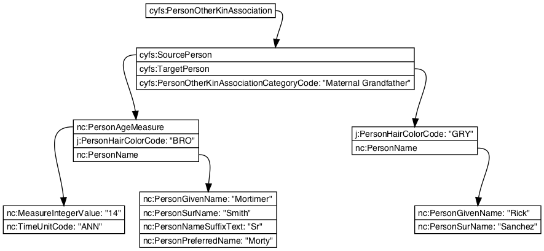

A NIEM exchange defines a simple object model. Here is an example of a simple
 object model, defined by a NIEM schema:



This object model can define the syntax of a JSON message, for example:

```text

```

This could be represented in JSON or XML. Here is a corresponding XML representation for the same data:

```text

```

You can exchange NIEM data either as XML or as JSON. Either way, the data that
is expected in a message, and the meaning of that data, is defined by NIEM
schemas.

The NIEM JSON representation uses JSON-LD, which means that order of NIEM JSON
data is flexible, that the names of keys is determined by JSON-LD contexts, that
the JSON representation is also an RDF representation, and that there are
additional tools available for working with NIEM JSON.

