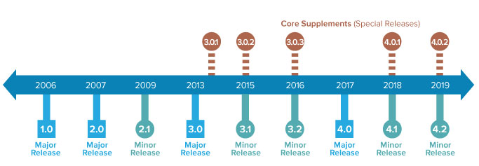

A **Core Supplement** is a special type of NIEM release that can be used in addition to a corresponding release.  It is strictly additive in nature.

A core supplement can be issued when the [NIEM Business Architecture Committee]({{site.data.links.nbac}}) (NBAC) determines it is necessary to add content to a published NIEM Core namespace, or a namespace imported by NIEM Core.  The purposes for issuing a CS may include:

- To update a code list with the latest values
- To publish bug fixes
- To support domain or community requirements

A Core Supplement can be published at any time, though they tend to coincide with NIEM minor releases as an interim way of adjusting Core content while waiting for the next major release.

During a major release, all of the changes in the Core Supplements for the previous major release series are merged back into the primary Core namespace.



## Versions

Core Supplements are versioned similar to the Core namespace, with a third digit representing the supplement number.

{:.example}
- CS 3.0.2 is the second Core Supplement for the NIEM Core 3.0 namespace.
- CS 4.0.1 is the first Core Supplement for the NIEM Core 4.0 namespace.

Core Supplements in the same series (e.g., 4.0.x) can be used individually or together, along with the corresponding NIEM Core namespace.

{:.valid}
- Use CS 3.0.1 and CS 3.0.2 with NIEM Core 3.0 (same series).

{:.invalid}
- Use CS 3.0.1 with NIEM Core 4.0 (different series).

## Namespaces

In order to make it easier to use Core Supplements along with the Core namespace in IEPDs, Core Supplements are given a different namespace prefix, corresponding to the CS version number.

{:.example}
- Element from Core 3.0 - `nc:LocationStateUSPostalServiceCode`
- Element from CS 3.0.1 - `nc-3.0.1:LocationStateUSPostalServiceCode`

Target namespaces of Core Supplements are similar to the Core target namespace, with two differences:

- `release` is changed to `publication` since it does not represent official major or minor release content.
- The supplement number is appended to the end.

{:.example}
- Core 3.0 target namespace: `http://release.niem.gov/niem/niem-core/3.0/`
- CS Core 3.0.1 target namespace: `http://publication.niem.gov/niem/niem-core/3.0/1/`

## Locations

Core Supplements are bundled with minor releases for convenience.  The files are located in a subfolder off of the folder for the primary namespace.

{:.example}
> - The 3.2 NIEM minor release includes three Core Supplements - 3.0.1, 3.0.2, and 3.0.3.
> - These files are located at:

```sh
- niem/
  - niem-core/
    - 3.0/
      - 1/
        - niem-core.xsd  # CS 3.0.1 Core schema
      - 2/
        - niem-core.xsd  # CS 3.0.2 Core schema
      - 3/
        - niem-core.xsd  # CS 3.0.3 Core schema
      - niem-core.xsd    # Core 3.0 schema (from the major release)
```

Core Supplements are also available individually in zip files at:

- [3.0 series of Core Supplements]({{ site.data.links.cs_3 }})
- [4.0 series of Core Supplements]({{ site.data.links.cs_4 }})

## Using a Core Supplement

Although a Core Supplement (CS) may be published outside of the standard release cycle and will be limited in scope and content as compared to its counterparts in a full release, it is still NIEM-conformant content and should be used in a similar manner.  Follow these steps:

- Determine if there is content in a CS that you need to use.
If not, no further steps need to be taken and the CS may be ignored.

- Determine if you have any existing IEPDs that need to be updated.
If so, reopen the IEPD subset wantlist in the Schema Subset Generation Tool (SSGT),
remove any old components you wish to replace, add the relevant new CS components,
and regenerate the subset.
Edit the IEPD extension schema document(s) to import the CS schema document(s),
reflect the changes made in the subset, and update the IEPD catalog and versioning metadata as needed.

- To use a CS as part of a new IEPD, include the relevant CS components
while creating your NIEM subset and build your IEPD as normal.

- Note that you may be able to integrate CS components into your IEPD extension schemas
via augmentations and/or element substitutions (especially for code list updates).
If so, this requires little additional effort beyond making sure the new components are available in the NIEM subset.
If augmentations and/or element substitutions are not available or appropriate, new components may be referenced
and used directly in the extension schema documents.

{:.example}
- If you use any of the following NIEM 3.0 components:
  - Element `nc:JurisdictionUSPostalServiceCode`
  - Element `nc:LocationStateUSPostalServiceCode`
  - Type `usps:USStateCodeType`
  - Type `usps:USStateCodeSimpleType`
- Then, you have the option of using updated content from CS 3.0.1 by updating your NIEM subset and IEPD with the following:
  - Element `nc-3.0.1:JurisdictionUSPostalServiceCode`
  - Element `nc-3.0.1:LocationStateUSPostalServiceCode`
  - Type `usps-3.0.1:USStateCodeType`
  - Type `usps-3.0.1:USStateCodeSimpleType`
